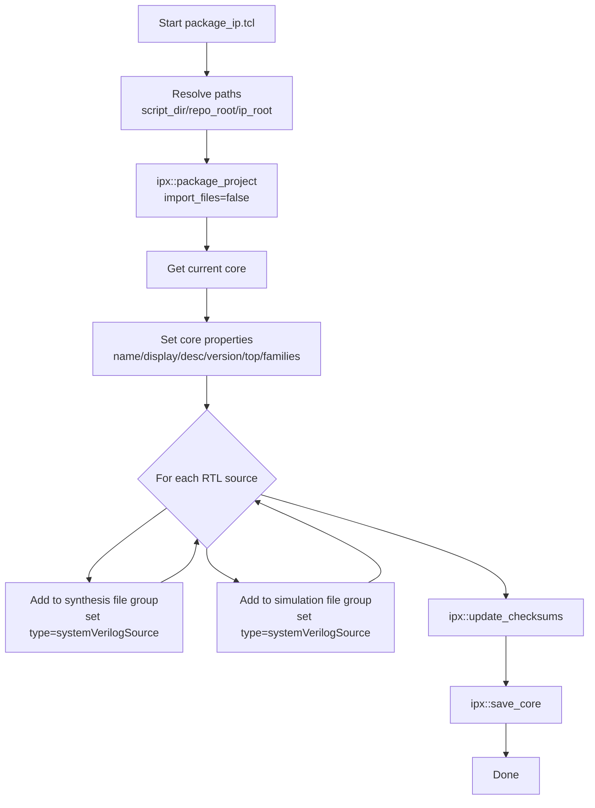

# `package_ip.tcl` 분석

## 개요
이 스크립트는 `per2axi` RTL을 **복사하지 않고 참조**하는 방식으로 AMD Vivado 커스텀 IP로 패키징합니다.

- IP 패키징 루트: `IP/per2axi_1_0`
- 벤더/라이브러리: `chorus96` / `user`
- 택소노미: `/UserIP`
- 코어 메타데이터: 이름, 표시명, 설명, 버전, 지원 디바이스 패밀리, top 모듈 설정

## 동작 흐름
1. 현재 스크립트 경로 기준으로 `script_dir`, `repo_root`, `ip_root` 계산
2. `ipx::package_project` 실행 (파일 import 비활성화)
3. 현재 코어 핸들 획득 후 코어 속성 설정
4. 지정된 SystemVerilog 소스 4개를
   - 합성 파일 그룹(`xilinx_anylanguagesynthesis`)
   - 시뮬레이션 파일 그룹(`xilinx_anylanguagebehavioralsimulation`)
   에 각각 등록
5. 체크섬 업데이트 및 코어 저장

## Block Diagram

## 핵심 포인트
- `-import_files false`로 설정되어 원본 RTL을 IP 디렉터리로 복사하지 않고 원본 경로를 참조합니다.
- 동일 RTL 파일을 합성/시뮬레이션 그룹에 모두 추가해 빌드/검증 경로를 맞춥니다.
- `supported_families`가 명시되어 대상 FPGA 패밀리가 제한됩니다.

## 포함되는 RTL 파일
- `src/per2axi_busy_unit.sv`
- `src/per2axi_req_channel.sv`
- `src/per2axi_res_channel.sv`
- `src/per2axi.sv`
