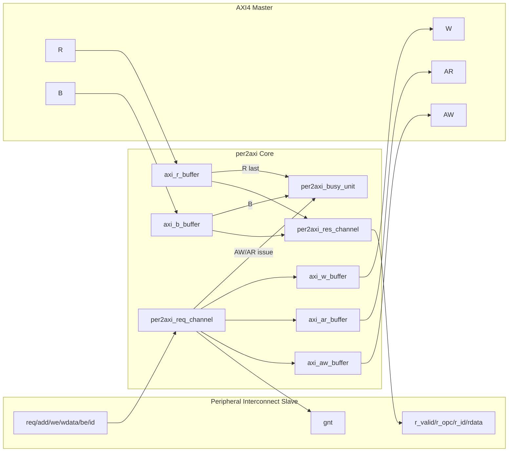

# per2axi Repository Full Analysis

이 문서는 저장소의 **전체 주요 파일**(RTL, 시뮬레이션, 빌드/패키징 스크립트, 문서)을 상세 분석한 통합 안내서입니다.

---

## 1) Repository 목적

`per2axi`는 peripheral interconnect slave 인터페이스를 AXI4 master 인터페이스로 변환하는 브리지 RTL입니다.

- peripheral 요청(`req/add/we/wdata/be/id`)을 AXI AW/AR/W 채널로 분해
- AXI R/B 응답을 peripheral response(`r_valid/r_id/rdata`)로 재조합
- outstanding transaction을 추적해 `busy_o` 출력

---

## 2) 디렉터리/파일 구성 요약

### 루트 메타/빌드
- `Bender.yml`: 패키지명, 의존성(`axi_slice`), 소스 목록/시뮬레이션 타깃 정의
- `src_files.yml`: core RTL 소스 목록
- `CHANGELOG.md`: 버전 변경 내역
- `LICENSE`: 라이선스
- `.gitignore`: 무시 파일 규칙

### RTL (`src/`)
- `per2axi.sv`: 최상위 브리지
- `per2axi_req_channel.sv`: peripheral request → AXI 요청 변환
- `per2axi_res_channel.sv`: AXI 응답 → peripheral response 변환
- `per2axi_busy_unit.sv`: outstanding 카운팅 및 busy 생성
- `*.sv.md`: 각 RTL 상세 분석 문서

### 시뮬레이션 (`sim/`, `scripts/`)
- `sim/tb_per2axi.sv`: 테스트벤치
- `sim/axi4_mm_slave_model.sv`: AXI4 MM slave 모델
- `scripts/gen_verilator_sim.sh`: Verilator용 filelist 생성
- `scripts/run_verilator_sim.sh`: 생성+실행 원샷 스크립트
- `scripts/verilator_sim.f`: Verilator 인자/소스 리스트

### Vivado IP 패키지 (`IP/per2axi_1_0/`)
- `package_ip.tcl`: Vivado IP 패키징 스크립트
- `component.xml`: Vivado IP 메타데이터
- `xgui/per2axi_v1_0.tcl`: IP 커스터마이즈 GUI 파라미터 로직
- `README.md`, `README.kr.md`: IP 디렉터리 설명 (영문/국문)
- `*.tcl.md`: Tcl 분석 문서

---

## 3) 핵심 데이터 경로/제어 경로



---

## 4) RTL 파일 상세

### 4.1 `src/per2axi.sv`
최상위 통합 모듈입니다.

- request/res/busy 서브모듈과 AXI 채널 버퍼들을 연결
- peripheral 32-bit 접근을 AXI(기본 64-bit) 접근으로 매핑
- read 응답 lane 선택을 위해 request→response 메타데이터(`trans_*`) 전달

참고 분석 문서: `src/per2axi.sv.md`

### 4.2 `src/per2axi_req_channel.sv`
peripheral request를 AXI AW/AR/W로 변환합니다.

- `we=0` write, `we=1` read 해석
- one-hot peripheral ID를 AXI binary ID로 변환
- `addr[2]`에 따라 32-bit 데이터를 AXI 64-bit 상/하위 lane에 배치
- byte enable 패턴으로 AXI `size` 계산
- read 요청 시 `trans_req/id/add`를 response 경로로 전달

주의점:
- grant 조건이 `aw_ready && ar_ready && w_ready`의 AND라서 read/write 유형 무관하게 3개 ready를 모두 요구

참고 분석 문서: `src/per2axi_req_channel.sv.md`

### 4.3 `src/per2axi_res_channel.sv`
AXI R/B 응답을 peripheral response로 변환합니다.

- read면 저장된 `addr[2]`를 기준으로 `r_data[31:0]` 또는 `[63:32]` 선택
- write 응답은 data 없이 valid/id만 반환
- R/B 동시 valid 시 R 우선

주의점:
- `per_slave_r_opc_o`는 현재 0 고정(AXI resp 에러 코드 미반영)
- ID별 주소 bit 저장소가 1bit/ID라 동일 ID 다중 outstanding read 사용 시 덮어쓰기 가능성

참고 분석 문서: `src/per2axi_res_channel.sv.md`

### 4.4 `src/per2axi_busy_unit.sv`
outstanding 트랜잭션 카운터입니다.

- write: AW issue 증가 / B 응답 감소
- read: AR issue 증가 / R-last 응답 감소
- 카운터 둘 중 하나라도 non-zero면 `busy_o=1`

참고 분석 문서: `src/per2axi_busy_unit.sv.md`

---

## 5) 시뮬레이션/검증 파일 분석

### 5.1 `scripts/gen_verilator_sim.sh`
- `bender script -t simulation verilator`로 Verilator 인자 파일 생성
- 결과를 `scripts/verilator_sim.f`로 저장
- 앞/뒤 공백 라인 제거(`sed -i`)로 lint-clean 유지

### 5.2 `scripts/run_verilator_sim.sh`
- 위 생성 스크립트를 호출해 filelist 최신화
- `verilator -f scripts/verilator_sim.f` 실행
- 생성된 실행파일 `obj_dir/Vtb_per2axi` 구동

### 5.3 `scripts/verilator_sim.f`
- Verilator 공통 옵션, define, include, dependency 소스, DUT/테스트벤치 소스 목록
- Bender 출력 파일이므로 dependency 버전/경로 상태를 반영

### 5.4 `sim/tb_per2axi.sv`, `sim/axi4_mm_slave_model.sv`
- smoke test 성격의 시뮬레이션 환경 구성
- DUT를 AXI slave model에 연결해 read/write 기본 동작 검증

---

## 6) Vivado IP 파일 분석

### 6.1 `IP/per2axi_1_0/package_ip.tcl`
- `ipx::package_project`로 custom IP 패키징
- `-import_files false`로 RTL 복사 없이 원본 경로 참조
- synth/sim file group에 동일 RTL 등록
- checksum 업데이트 후 core 저장

참고 분석 문서: `IP/per2axi_1_0/package_ip.tcl.md`

### 6.2 `IP/per2axi_1_0/xgui/per2axi_v1_0.tcl`
- Vivado IP customization GUI 파라미터 노출
- `AXI_STRB_WIDTH`를 `AXI_DATA_WIDTH/8`로 자동 계산
- GUI 파라미터를 HDL model param으로 전달

참고 분석 문서: `IP/per2axi_1_0/xgui/per2axi_v1_0.tcl.md`

### 6.3 `IP/per2axi_1_0/component.xml`
- Vivado IP core 메타데이터(인터페이스/파일/파라미터) 보유
- `README.md` 설명대로 RTL은 상대 경로 참조 기반

### 6.4 `IP/per2axi_1_0/README.md`, `README.kr.md`
- IP 패키지 성격, 재패키징 명령, dependency 주의사항 안내

---

## 7) 빌드/통합 관점 체크포인트

1. **외부 의존성**: `axi_slice` 및 그 하위 dependency 소스가 Vivado/시뮬레이션 환경에 있어야 함.
2. **grant 정책**: request 채널의 엄격한 ready AND 조건이 시스템 throughput에 미치는 영향 검토 필요.
3. **ID/Outstanding 가정**: response 채널의 ID별 lane metadata 저장 방식은 동일 ID 다중 outstanding에서 제약 가능.
4. **에러 전파**: AXI `resp`를 peripheral opcode/에러로 전달하지 않으므로 시스템 요구사항과 정합성 확인 필요.

---

## 8) 빠른 사용 가이드

### Verilator 실행
```bash
scripts/run_verilator_sim.sh
```

### Vivado IP 재패키징
```bash
vivado -mode batch -source IP/per2axi_1_0/package_ip.tcl
```

---

## 9) 문서 관계

- 이 문서(`readme.md`): 저장소 전체 통합 분석
- `src/*.sv.md`: RTL 파일별 상세 분석
- `IP/per2axi_1_0/*.tcl.md`: Vivado Tcl 파일별 상세 분석

필요하면 다음 단계로 `tb_per2axi.sv`, `axi4_mm_slave_model.sv`까지 라인 단위로 추가 심층 분석 문서를 생성해 드릴 수 있습니다.
