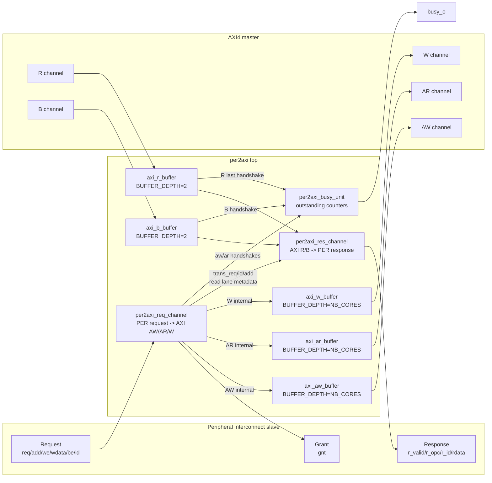
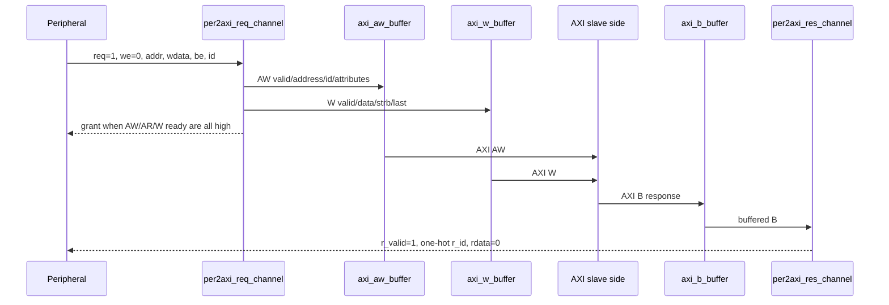
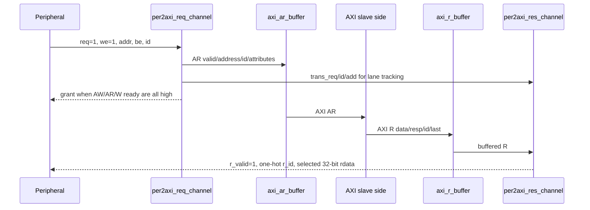

# `per2axi.sv` 상세 분석

## 개요

`per2axi`는 peripheral interconnect slave 포트를 AXI4 master 포트로 변환하는 최상위 브리지 모듈입니다. 내부적으로 request 변환기, response 변환기, outstanding transaction busy 추적기, 그리고 AXI 각 채널별 buffer를 인스턴스화합니다. peripheral 쪽은 32-bit data request/response 인터페이스이고, AXI 쪽은 기본 64-bit data 폭의 master 인터페이스입니다.

## 전체 블록 다이어그램

## 파라미터

| 파라미터 | 기본값 | 설명 |
| --- | --- | --- |
| `NB_CORES` | 4 | AW/AR/W buffer depth로 사용됩니다. 이름상 peripheral master/core 수에 해당합니다. |
| `PER_ADDR_WIDTH` | 32 | peripheral 주소 폭입니다. |
| `PER_ID_WIDTH` | 5 | peripheral one-hot ID 및 response ID 폭입니다. |
| `AXI_ADDR_WIDTH` | 32 | AXI 주소 폭입니다. |
| `AXI_DATA_WIDTH` | 64 | AXI data 폭입니다. request/response 채널은 32-bit peripheral data를 이 폭의 lane에 매핑합니다. |
| `AXI_USER_WIDTH` | 6 | AXI user 신호 폭입니다. request 변환기에서는 0으로 tie-off됩니다. |
| `AXI_ID_WIDTH` | 3 | AXI binary ID 폭입니다. |
| `AXI_STRB_WIDTH` | `AXI_DATA_WIDTH/8` | AXI write strobe 폭입니다. |

## 외부 인터페이스

### 공통 신호

* `clk_i`: 내부 AXI buffer, response 주소 bit 저장, busy counter에 사용되는 클록입니다.
* `rst_ni`: active-low reset입니다.
* `test_en_i`: AXI channel buffer에 전달되는 test enable입니다.

### Peripheral interconnect slave

* Request: `per_slave_req_i`, `per_slave_add_i`, `per_slave_we_i`, `per_slave_wdata_i`, `per_slave_be_i`, `per_slave_id_i`
* Grant: `per_slave_gnt_o`
* Response: `per_slave_r_valid_o`, `per_slave_r_opc_o`, `per_slave_r_id_o`, `per_slave_r_rdata_o`

`per2axi_req_channel`의 RTL 기준으로 `per_slave_we_i=0`이면 write 요청, `per_slave_we_i=1`이면 read 요청으로 처리됩니다.

### AXI4 master

모듈은 표준 AXI write address(AW), read address(AR), write data(W), read data(R), write response(B) 채널을 master 방향으로 제공합니다. 각 채널은 내부 buffer를 통해 외부 AXI 포트와 연결됩니다.

## 내부 구성 요소

### `per2axi_req_channel`

Peripheral request를 AXI AW/AR/W 내부 신호(`s_aw_*`, `s_ar_*`, `s_w_*`)로 변환합니다. 주요 기능은 다음과 같습니다.

* write request에서 AW와 W를 동시에 생성합니다.
* read request에서 AR을 생성합니다.
* peripheral one-hot ID를 AXI binary ID로 변환합니다.
* 32-bit write data와 byte enable을 주소 bit 2에 따라 64-bit AXI data/strobe의 하위 또는 상위 lane에 배치합니다.
* read request 발생 시 `s_trans_req`, `s_trans_id`, `s_trans_add`를 response 채널로 전달합니다.

### `per2axi_res_channel`

AXI R/B 내부 응답(`s_r_*`, `s_b_*`)을 peripheral response로 변환합니다.

* R 응답은 저장된 read 주소 bit 2를 기준으로 64-bit AXI data 중 32-bit lane을 선택합니다.
* B 응답은 data 없이 response valid와 one-hot ID를 생성합니다.
* R과 B가 동시에 valid이면 R을 우선 처리합니다.

### `per2axi_busy_unit`

AW/B, AR/R-last 핸드셰이크를 기준으로 outstanding write/read transaction 수를 카운트합니다. 두 카운터 중 하나라도 0이 아니면 `busy_o=1`입니다.

### AXI channel buffers

각 AXI 채널은 별도 buffer를 통과합니다.

| 인스턴스 | 채널 | Buffer depth | 역할 |
| --- | --- | --- | --- |
| `aw_buffer_i` | AW | `NB_CORES` | request channel의 AW를 외부 AXI AW로 버퍼링합니다. |
| `ar_buffer_i` | AR | `NB_CORES` | request channel의 AR을 외부 AXI AR로 버퍼링합니다. |
| `w_buffer_i` | W | `NB_CORES` | request channel의 W data를 외부 AXI W로 버퍼링합니다. |
| `r_buffer_i` | R | 2 | 외부 AXI R을 response channel 입력으로 버퍼링합니다. |
| `b_buffer_i` | B | 2 | 외부 AXI B를 response channel 입력으로 버퍼링합니다. |

## 데이터 흐름

### Write transaction 흐름

### Read transaction 흐름

## Handshake 및 busy 생성

`busy_unit_i`는 buffer 이전의 내부 handshake를 감시합니다.

* write 시작: `s_aw_valid & s_aw_ready`
* write 완료: `s_b_valid & s_b_ready`
* read 시작: `s_ar_valid & s_ar_ready`
* read 완료: `s_r_valid & s_r_ready & s_r_last`

이 방식은 request가 내부 buffer에 수락된 시점부터 response가 response channel에서 소비되는 시점까지 busy를 유지합니다.

## 설계상 유의점

* `per_slave_gnt_o`는 request 채널 내부에서 AW/AR/W ready가 모두 1일 때만 1입니다. read에는 AW/W가 직접 필요 없고 write에는 AR이 직접 필요 없지만, 현재 RTL은 세 ready의 AND를 grant 조건으로 사용합니다.
* request 채널은 단일 beat AXI 전송만 생성합니다. AW/AR `len`은 0이고 W `last`는 write valid와 함께 1입니다.
* response 채널은 AXI `resp` 에러 정보를 peripheral `opc`로 변환하지 않고 0으로 유지합니다.
* read data lane 선택을 위해 ID별 주소 bit 2만 저장합니다. 같은 AXI ID의 여러 outstanding read가 허용될 경우 lane metadata overwrite 위험을 검토해야 합니다.
* `axi_*_buffer` 모듈들은 이 파일에서 정의되지 않은 외부 의존 모듈입니다. 합성/시뮬레이션 시 해당 buffer RTL 또는 라이브러리가 함께 제공되어야 합니다.

## 내부 신호 명명 규칙

* `s_aw_*`, `s_ar_*`, `s_w_*`: request 채널 출력이자 AXI request buffer slave-side 입력입니다.
* `s_r_*`, `s_b_*`: AXI response buffer master-side 출력이자 response 채널 입력입니다.
* `s_trans_*`: read request metadata로, response channel이 64-bit read data 중 32-bit lane을 선택하는 데 사용합니다.

## 요약

`per2axi`는 peripheral의 간단한 request/response 프로토콜을 AXI4의 5채널 구조로 분리하고 다시 합치는 브리지입니다. request 방향에서는 주소, ID, data lane, strobe, AXI 속성을 생성하고, response 방향에서는 R/B 응답을 peripheral response로 직렬화합니다. busy 출력은 내부에서 발행되었지만 아직 응답 완료되지 않은 AXI 트랜잭션이 존재하는지 알려주는 상태 신호입니다.
