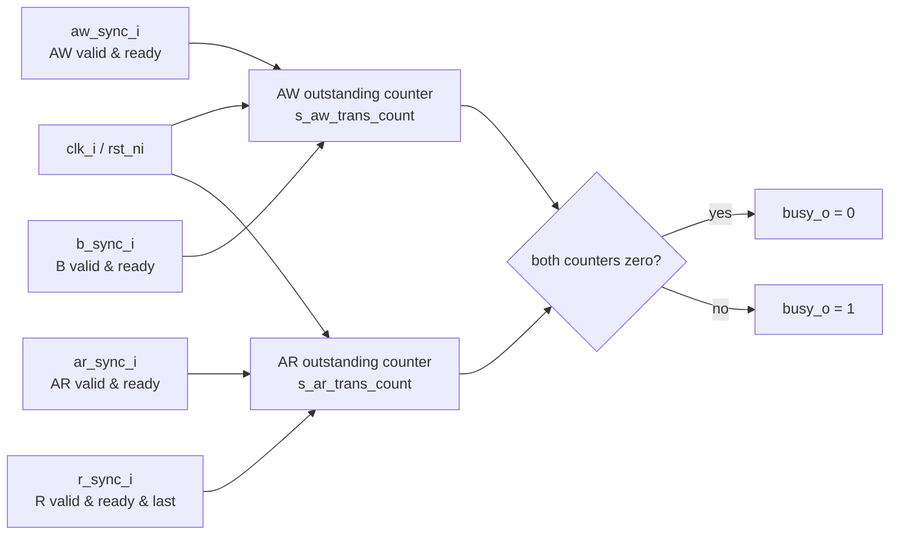

# `per2axi_busy_unit.sv` 상세 분석

## 개요

`per2axi_busy_unit`는 `per2axi` 브리지 내부의 outstanding AXI 트랜잭션 수를 추적하여 외부로 `busy_o`를 내보내는 단순 상태 추적 블록입니다. 쓰기 경로는 AW 핸드셰이크와 B 응답 핸드셰이크를 비교해 미완료 쓰기 수를 세고, 읽기 경로는 AR 핸드셰이크와 마지막 R beat 핸드셰이크를 비교해 미완료 읽기 수를 셉니다.

## 블록 다이어그램



## 포트 설명

| 포트 | 방향 | 설명 |
| --- | --- | --- |
| `clk_i` | 입력 | outstanding 카운터를 갱신하는 클록입니다. |
| `rst_ni` | 입력 | 비동기 active-low 리셋입니다. 두 카운터를 0으로 초기화합니다. |
| `aw_sync_i` | 입력 | AXI write address 채널 핸드셰이크 펄스입니다. |
| `b_sync_i` | 입력 | AXI write response 채널 핸드셰이크 펄스입니다. |
| `ar_sync_i` | 입력 | AXI read address 채널 핸드셰이크 펄스입니다. |
| `r_sync_i` | 입력 | AXI read data의 마지막 beat 핸드셰이크 펄스입니다. |
| `busy_o` | 출력 | outstanding 읽기/쓰기 트랜잭션이 하나라도 있으면 1입니다. |

## 내부 신호

| 신호 | 폭 | 설명 |
| --- | --- | --- |
| `s_aw_trans_count` | 4 bit | B 응답을 아직 받지 못한 AW 트랜잭션 수입니다. |
| `s_ar_trans_count` | 4 bit | 마지막 R beat를 아직 받지 못한 AR 트랜잭션 수입니다. |

## 동작 상세

### 쓰기 outstanding 카운터

* 리셋 시 `s_aw_trans_count`는 0이 됩니다.
* `aw_sync_i=1`이고 `b_sync_i=0`이면 새 write transaction이 발행된 것으로 보고 1 증가합니다.
* `aw_sync_i=0`이고 `b_sync_i=1`이면 write response가 도착한 것으로 보고 1 감소합니다.
* 둘 다 0이거나 둘 다 1이면 outstanding 개수의 순 변화가 없으므로 값을 유지합니다.

### 읽기 outstanding 카운터

* 리셋 시 `s_ar_trans_count`는 0이 됩니다.
* `ar_sync_i=1`이고 `r_sync_i=0`이면 새 read transaction이 발행된 것으로 보고 1 증가합니다.
* `ar_sync_i=0`이고 `r_sync_i=1`이면 read transaction의 마지막 data beat가 완료된 것으로 보고 1 감소합니다.
* 둘 다 0이거나 둘 다 1이면 값을 유지합니다.

### busy 생성

`busy_o`는 두 카운터가 모두 0일 때만 0이고, 하나라도 0이 아니면 1입니다. 따라서 request 채널이 이미 AXI 측에 요청을 넘긴 뒤 응답이 아직 완료되지 않은 동안에는 busy 상태가 유지됩니다.

## 설계상 유의점

* 카운터 폭이 4 bit이므로 각 경로에서 동시에 추적 가능한 outstanding 개수는 모듈 관점에서 0~15 범위입니다. 상위 `per2axi`에서는 버퍼 깊이 및 ID 개수에 의해 실제 outstanding 수가 제한됩니다.
* `r_sync_i`는 마지막 R beat에서만 들어와야 합니다. 상위 모듈은 `s_r_valid & s_r_ready & s_r_last`를 연결하므로 burst read의 중간 beat는 카운터를 감소시키지 않습니다.
* 카운터 underflow/overflow 보호 로직은 별도로 없습니다. 입력 핸드셰이크 펄스는 프로토콜상 짝이 맞게 들어와야 합니다.

## 의사 코드

```text
on reset:
  aw_count = 0
  ar_count = 0

on each clock:
  if aw_sync and not b_sync: aw_count++
  if b_sync and not aw_sync: aw_count--
  if ar_sync and not r_sync: ar_count++
  if r_sync and not ar_sync: ar_count--

busy_o = (aw_count != 0) or (ar_count != 0)
```
